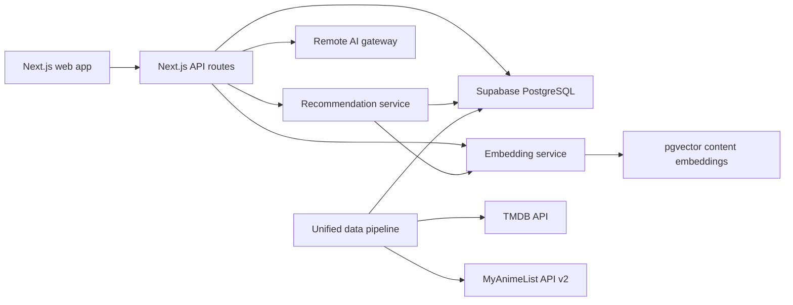

# EntertainmentAI Architecture



## Repository boundaries

```text
app/                    Next.js UI and API routes
lib/                    Shared TypeScript runtime contracts and clients
data-pipeline/          Batch 1 TMDB/MAL ingestion, normalization, logging, and Supabase upsert pipeline
nexaplay-embedding-service/  Standalone embedding API
recommendation-service/      Standalone recommendation API
worker-service/              Scheduled sync and maintenance jobs
supabase/                Production Supabase migrations
```

## Request paths

### Recommendation

1. The client requests `/recommendations`.
2. The API loads profile, ratings, history, and candidate content.
3. Content and collaborative components produce normalized scores.
4. The ranker applies the 0.6/0.4 policy.
5. The explanation layer describes the strongest matching signals.

### AI assistant

1. The client sends a message to `/ai/chat`.
2. Intent detection extracts type, language, country, theme, and entities.
3. Semantic retrieval produces candidates.
4. The universal ranker orders candidates.
5. The remote AI gateway explains the result; deterministic explanation remains available when the gateway is offline.

### Catalog synchronization

1. A scheduled job runs `data-pipeline/main.py`.
2. Provider modules apply retry, timeout, and rate limiting while fetching raw data.
3. The pipeline maps every provider payload to the Supabase `contents` vocabulary.
4. Sparse records are grouped so an upsert does not erase richer metadata.
5. Supabase upsert uses `(source, external_id)` as the idempotency key.
6. Later batches can enrich normalized content without changing this ingestion contract.

## Deployment profile

Vercel hosts the Next.js application. Supabase is the canonical database, while
embedding, recommendation, and worker services run as separate production
services.
