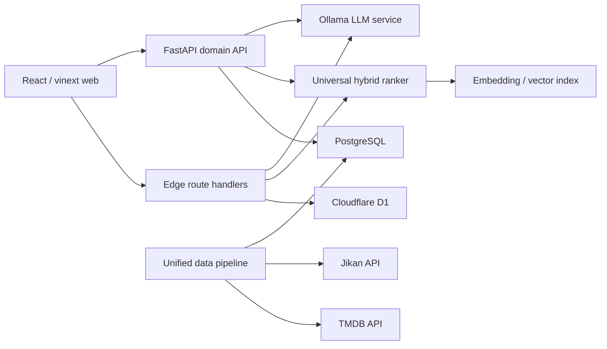

# EntertainmentAI Architecture



## Repository boundaries

```text
app/                    Web UI and edge API routes
db/                     Drizzle schema and D1 access
drizzle/                Generated D1 migrations
lib/                    Shared TypeScript catalog and ranking contracts
backend/                FastAPI and PostgreSQL domain service
ml-service/             Universal hybrid recommendation engine and tests
ai-service/             Ollama-compatible explanation service
data-pipeline/          Primary TMDB/Jikan ingestion, normalization, Supabase upsert, and embedding pipeline
```

## Request paths

### Recommendation

1. The client requests `/recommendations`.
2. The API loads profile, ratings, history, and candidate content.
3. Content and collaborative components produce normalized scores.
4. The ranker applies the 0.6/0.4 policy.
5. The explanation layer describes the strongest matching signals.

### AI assistant

1. The client sends a message to `/ai/chat`.
2. Intent detection extracts type, language, country, theme, and entities.
3. Semantic retrieval produces candidates.
4. The universal ranker orders candidates.
5. Ollama explains the result; deterministic explanation remains available when Ollama is offline.

### Catalog synchronization

1. A scheduled job runs `data-pipeline/main.py`.
2. Provider modules apply retry, timeout, and rate limiting while fetching raw data.
3. The pipeline maps every provider payload to the Supabase `contents` vocabulary.
4. Sparse records are grouped so an upsert does not erase richer metadata.
5. Supabase upsert uses `(source, external_id)` as the idempotency key.
6. Embeddings can be generated separately from normalized content.

## Deployment profiles

- Sites profile: vinext + Worker routes + D1, optimized for the hosted product preview.
- Service profile: React frontend + FastAPI + PostgreSQL + separate ML/AI/sync services.

Both profiles share the same content vocabulary and recommendation response shape.
